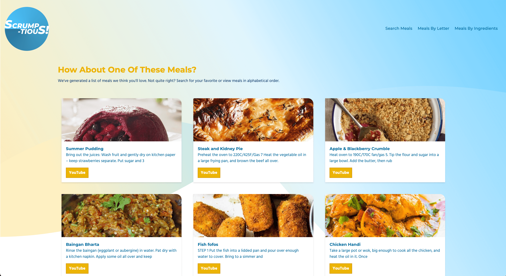

# A Recipe App using the MealDB API Vue 3 + Vite

API: [MealDB](https://www.themealdb.com/api.php)
YouTube Tutorial by [The Codaholic](https://youtu.be/cfiN8lCA3RM)

[Live link on netlify](https://silly-raindrop-967589.netlify.app/)

